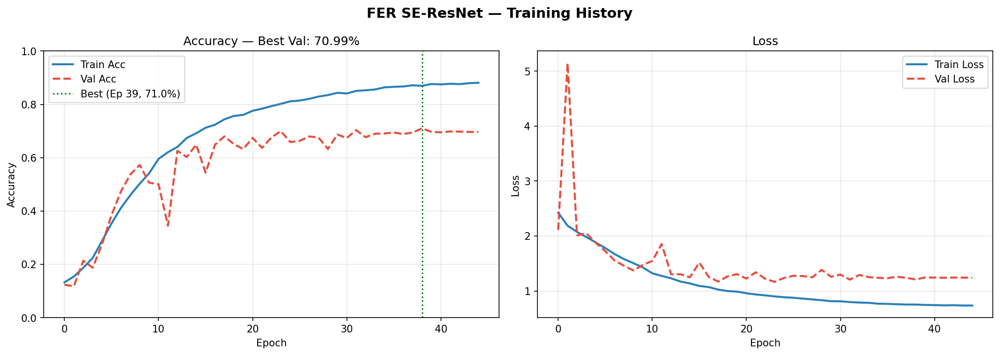
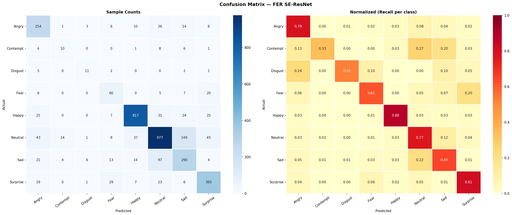
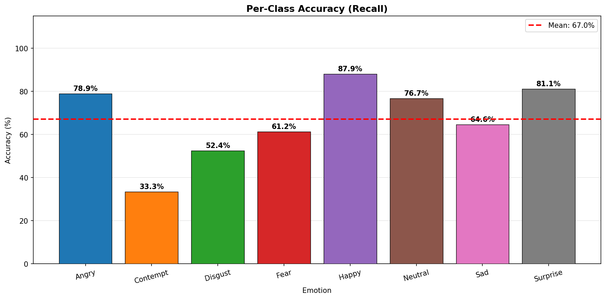
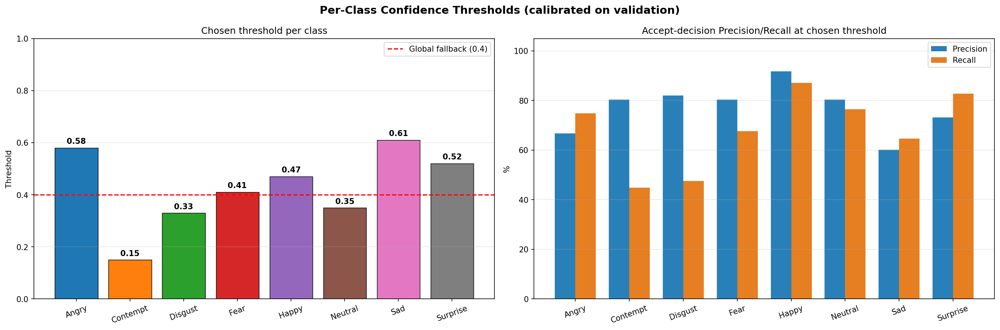

<div dir="rtl">

<h1 align="center">🎭 تشخیص احساسات چهره با SE-ResNet</h1>

<p align="center">
  <b>یک سامانهٔ کامل یادگیری عمیق که ۸ احساس چهره را به‌صورت زنده تشخیص می‌دهد.</b><br>
  شبکهٔ SE-ResNet سفارشی · خط‌لولهٔ دادهٔ جریانی <code>tf.data</code> · کالیبراسیون آستانهٔ هر-کلاس · تشخیص زندهٔ وب‌کم
</p>

<p align="center">
  <a href="../README.md">🇬🇧 English</a> · <b>🇮🇷 فارسی</b>
</p>

<p align="center">
  
  
  
</p>

<p align="center">
  🎓 پروژهٔ پایانیِ درسِ <b>داده‌کاوی</b> در <b>دانشگاه خوارزمی تهران</b><br>
  با راهنمایی و نظارتِ ارزشمندِ <b>پروفسور کیوان برنا</b>
</p>

---

## ✨ معرفی

این پروژه **۸ احساس** — `خشم · تحقیر · انزجار · ترس · شادی · خنثی · غم · تعجب` — را از روی تصویر چهره
تشخیص می‌دهد و از وب‌کم به‌صورت زنده کار می‌کند. این پروژه به‌عنوان **پروژهٔ پایانیِ درسِ داده‌کاوی** در
**دانشگاه خوارزمی تهران** و با **راهنماییِ پروفسور کیوان برنا** ساخته شده است، با تمرکز بر
**انجام درستِ کار**: خط‌لولهٔ دادهٔ کم‌حافظه، معماری مدرنِ مبتنی بر توجه، تفکیک منضبطِ
داده‌های آموزش/اعتبارسنجی/آزمون، و یک لایهٔ استنتاج تنظیم‌شده برای دنیای واقعی.

با وجود **سبک‌بودن (۲.۹ میلیون پارامتر)** و آموزش کامل روی **CPU لپ‌تاپ (اپل M2، بدون کارت گرافیک)**،
مدل به دقتِ **۷۷.۹٪ حدسِ اول** و **۹۲.۴٪ دو-حدسِ برتر** روی دادهٔ آزمون می‌رسد — نزدیک به سطحِ توافقِ
انسانی در این مسئلهٔ دشوارِ ۸‌کلاسه (حدسِ تصادفی = ۱۲.۵٪).

---

## 🏆 نتایج (روی دادهٔ آزمونِ کنارگذاشته‌شده)

| معیار | مقدار |
|--------|:-----:|
| **دقت حدسِ اول (Top-1)** | **۷۷.۹۲٪** |
| **دقت دو-حدسِ برتر (Top-2)** | **۹۲.۴۴٪** |
| F1 وزن‌دار | ۷۸.۲۶٪ |
| F1 کلان (Macro) | ۶۵.۲۹٪ |

### گزارش هر کلاس

| احساس | Precision | Recall | F1 | تعداد |
|---------|:---------:|:------:|:--:|:-------:|
| شادی    | 0.92 | 0.88 | **0.90** | 929 |
| خنثی    | 0.84 | 0.77 | **0.80** | 1274 |
| تعجب    | 0.78 | 0.81 | **0.79** | 450 |
| خشم     | 0.67 | 0.79 | **0.73** | 322 |
| غم      | 0.58 | 0.65 | **0.61** | 449 |
| ترس     | 0.48 | 0.61 | **0.54** | 98 |
| انزجار  | 0.50 | 0.52 | **0.51** | 21 |
| تحقیر   | 0.34 | 0.33 | **0.34** | 30 |

> دادهٔ آزمون به‌شدت نامتوازن است (مثلاً فقط ۲۱ نمونهٔ انزجار / ۳۰ تحقیر)، برای همین
> در کنار دقت کلی، معیارهای Macro-F1 و per-class هم گزارش شده‌اند.

### 📊 نتایج تصویری

| تاریخچهٔ آموزش | ماتریس درهم‌ریختگی |
|:---:|:---:|
|  |  |

| دقت هر کلاس | آستانه‌های کالیبره‌شده |
|:---:|:---:|
|  |  |

---

## 🧠 معماری — SE-ResNet

مدل ترکیبی از دو ایدهٔ معتبر و برندهٔ جوایز است:

- **بلوک‌های باقیمانده (ResNet, CVPR 2016)** — اتصال‌های میان‌بُر که اجازه می‌دهند گرادیان در شبکهٔ عمیق جریان یابد.
- **توجهِ فشردن‌و‌برانگیختن (SENet, CVPR 2017)** — واحدی سبک که یاد می‌گیرد *کدام کانال‌های ویژگی مهم‌ترند* و آن‌ها را تقویت می‌کند.

<div dir="ltr">

```
Input 64×64×1
  → Augmentation (فقط آموزش) → Rescaling(1/255)         # پیش‌پردازش داخلِ مدل
  → Stem: Conv 3×3 + BN + ReLU + MaxPool                 (64 → 32)
  → Stage 1: 2 × SE-Residual (64  ch)                    (32×32)
  → Stage 2: 2 × SE-Residual (128 ch, stride 2)          (32 → 16)
  → Stage 3: 2 × SE-Residual (256 ch, stride 2)          (16 → 8)
  → GlobalAveragePooling → Dropout → Dense(256) → Dropout
  → Dense(8) + Softmax
```

</div>

**چرا پیش‌پردازش داخلِ مدل است؟** نرمال‌سازی و افزایش داده به‌صورت لایه‌های Keras *داخلِ* شبکه‌اند،
پس آموزش و استنتاج تضمیناً یکسان‌اند — این یک طبقهٔ کاملِ باگ‌های پنهانِ ناهماهنگی را حذف می‌کند.

---

## 🔬 تکنیک‌های کلیدی

| تکنیک | چرا استفاده شد |
|-----------|---------------|
| **خط‌لولهٔ جریانی `tf.data`** | ۶۶ هزار تصویر را از دیسک جریانی می‌خواند — حافظهٔ کم و ثابت (روی ۸ گیگ) |
| **AdamW + زمان‌بندی Cosine + Warmup** | همگرایی پایدار و تعمیم‌پذیری بالا |
| **Label Smoothing** | جلوگیری از بیش‌اطمینانی |
| **وزن‌دهی نمونه‌ها** | جبران عدم‌توازن خفیف کلاس‌ها |
| **افزایش دادهٔ داخل مدل** | چرخش/فلیپ/زوم/جابه‌جایی/کنتراست/روشنایی روی گراف |
| **کالیبراسیون آستانهٔ هر-کلاس** ⭐ | مشاهدهٔ پایین — مهم‌ترین نوآوری |
| **بازتولیدپذیری** | seed ثابت + ذخیرهٔ خودکار `training_config.json` |

### ⭐ کالیبراسیون آستانهٔ اطمینانِ هر-کلاس

یک آستانهٔ ثابتِ «Uncertain» عادلانه نیست: کلاس‌های آسان (شادی) مطمئن‌اند و کلاس‌های سخت
(تحقیر، ترس) کم‌اطمینان — پس یک آستانهٔ ثابت، پیش‌بینی‌های درستِ کلاس‌های سخت را اشتباهاً رد می‌کند.
به‌جای آن، `calibrate_thresholds.py` برای **هر کلاس یک آستانهٔ جدا** پیدا می‌کند که F1 آن کلاس را
**روی دادهٔ اعتبارسنجی** بیشینه کند (هرگز روی آزمون — که نشت داده است). وب‌کم به‌طور خودکار از این
آستانه‌ها استفاده می‌کند.

### 🎥 استنتاج زنده، تنظیم‌شده برای دنیای واقعی

لایهٔ وب‌کم استحکامِ زمانِ استنتاج را اضافه می‌کند — همه در `config.py` قابل تنظیم **بدون آموزش مجدد**:

- **هموارسازی زمانی** — میانگین احتمالات روی چند فریم اخیر برای حذفِ پرش/فلیکر.
- **تصحیح سوگیری خنثی** — جبرانِ تمایلِ مدل به پیش‌بینیِ بیش‌ازحدِ «خنثی».
- **مقیاس‌دهی آستانه** — شل‌کردن آستانه‌ها برای تجربهٔ زندهٔ روان‌تر.
- **هماهنگی کادر چهره** — کادرِ تنگ‌تر برای تطبیق با توزیعِ آموزش.

---

## 📁 ساختار پروژه

<div dir="ltr">

```
├── config.py               # منبع یگانهٔ حقیقت: مسیرها، کلاس‌ها، هایپرپارامترها، تنظیمات استنتاج
├── data_pipeline.py        # سازندهٔ tf.data برای train/val/test + وزن کلاس‌ها
├── preprocessing.py        # تحلیل دیتاست: نمودار توزیع، شبکهٔ نمونه، بررسی تصاویر خراب
├── train_model.py          # تعریف SE-ResNet + حلقهٔ آموزش
├── calibrate_thresholds.py # کالیبراسیون آستانهٔ هر-کلاس
├── evaluate_model.py       # ارزیابی کامل: F1، ماتریس درهم‌ریختگی، تحلیل خطا
├── webcam_inference.py     # استنتاج زنده (وب‌کم / عکس / پوشه)
├── utils.py                # ابزارهای کمکی
├── models/                 # مدل ذخیره‌شده، کانفیگ آموزش، آستانه‌ها
└── results/                # همهٔ نمودارها و گزارش‌ها
```

</div>

---

## 🚀 شروع

<div dir="ltr">

```bash
# ۱) نصب
pip install -r requirements.txt
# GPU اپل سیلیکون (اختیاری): pip install tensorflow-metal

# ۲) دیتاست را در Faces/ قرار بده (train / validation / test)

# ۳) اجرای پایپ‌لاین
python preprocessing.py          # تحلیل دیتاست (اختیاری)
python train_model.py            # آموزش (~۵ ساعت روی M2 CPU)
python calibrate_thresholds.py   # کالیبراسیون آستانه‌ها
python evaluate_model.py         # ارزیابی نهایی روی test

# ۴) تشخیص زنده
python webcam_inference.py --mode webcam
```

</div>

> ⚠️ پوشهٔ «تعجب» روی دیسک با املای **`suprise`** ذخیره شده؛ `config.py` دقیقاً همین را می‌خواند
> تا کلاس درست لود شود و در نمودارها «Surprise» نمایش می‌دهد.

---

## 🎓 بستر آکادمیک و قدردانی

این پروژه به‌عنوان **پروژهٔ پایانیِ درسِ داده‌کاوی** در **دانشگاه خوارزمی تهران** انجام شده است.

از **پروفسور کیوان برنا** به‌خاطر راهنمایی‌های ارزشمند، نظارتِ دقیق و حمایتِ مستمرشان در طول این
پروژه صمیمانه سپاسگزارم. راهنماییِ ایشان نقشی کلیدی در شکل‌گیریِ روش‌شناسی و کیفیتِ این کار داشت،
و انجامِ این پروژه زیرِ نظرِ ایشان افتخاری بزرگ برای من بوده است.

> **استاد راهنما:** پروفسور کیوان برنا — دانشگاه خوارزمی تهران
> **درس:** داده‌کاوی (Data Mining)

## 📜 مجوز

منتشرشده تحت [مجوز MIT](../LICENSE).


</div>
